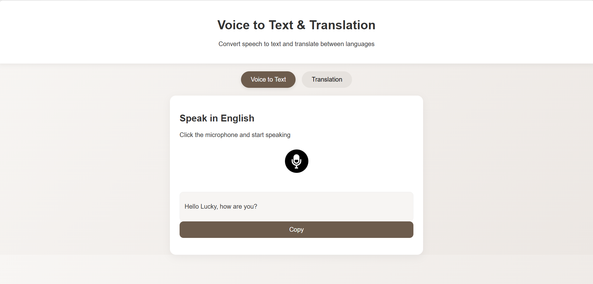
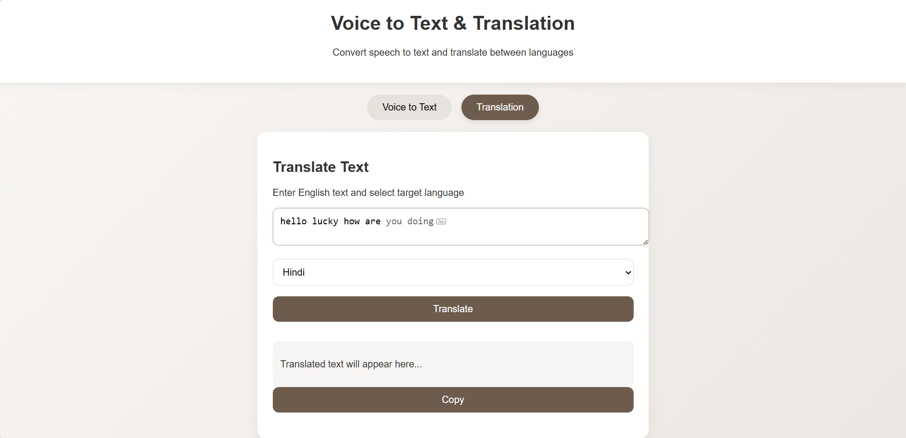
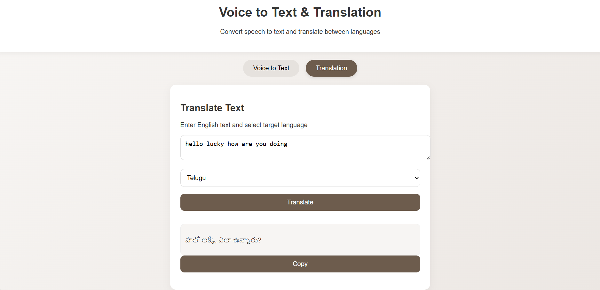
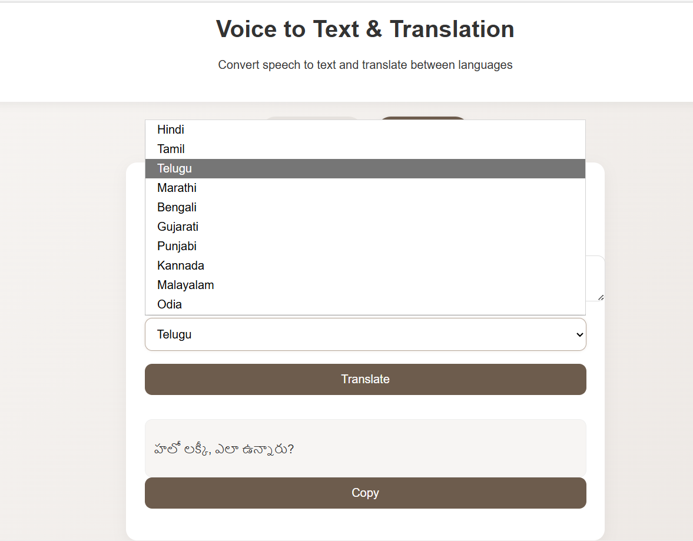

# Voice to Text and Language Translation Web App

## Overview
This project is a web-based application that performs real-time voice-to-text conversion and multilingual translation. It captures spoken English and converts it into text using the Web Speech API, and translates text into multiple Indian languages using an API.

The application is designed with a simple interface and enhanced UI styling for better user experience.

---

## Features

- Voice to text conversion using browser speech recognition  
- Real-time speech input processing  
- Text translation into multiple Indian languages  
- Tab-based navigation between modules  
- Copy-to-clipboard functionality  
- Clean and responsive user interface  
- Smooth animations and light aesthetic design  

---

## Technologies Used

- HTML  
- CSS  
- JavaScript  
- Web Speech API  
- Google Apps Script API  

---

## Project Structure

- proj2.html  
  - Contains complete application including UI, styling, and JavaScript logic  

---

## Step-by-Step Working

### 1. User Interface Initialization
- The page loads with two tabs:
  - Voice to Text  
  - Translation  
- The Voice to Text tab is active by default  

### 2. Tab Switching
- Clicking tabs triggers:
  - `showVoiceToText()`  
  - `showTranslation()`  
- These functions:
  - Show one section  
  - Hide the other  
  - Update active tab styling  

### 3. Voice to Text Process
- User clicks the microphone button  
- Function `startRecording()` is triggered  
- Browser uses Web Speech API to capture audio  
- Speech is converted into text  
- Output is displayed in the result box  

### 4. Copy Voice Output
- User clicks "Copy"  
- Function `copyVoiceText()` is triggered  
- Text is copied to clipboard using browser API  

### 5. Text Translation Process
- User enters text in textarea  
- Selects target language  
- Clicks "Translate"  
- Function `translateText()` is triggered  
- API request is sent with input text and language  
- Translated result is displayed  

### 6. Copy Translated Text
- User clicks "Copy"  
- Function `copyTranslatedText()` is triggered  
- Translated text is copied to clipboard  

---

## Setup Instructions

- Clone the repository  
- Open the file `proj2.html` in any modern browser  
- Allow microphone permission when prompted  
- Ensure internet connection for translation API  

---

## Design Improvements

- Light and aesthetic color scheme  
- Smooth animations using CSS keyframes  
- Hover effects for buttons and tabs  
- Improved spacing and layout for readability  

---

## Limitations

- Speech recognition accuracy depends on browser support  
- Telugu and some regional languages may not be perfectly recognized  
- Requires internet connection for translation  

---

## How Others Can Enhance This Project

This is an open project and contributors are encouraged to improve it further. Possible enhancements include:

- Add support for more regional and international languages  
- Improve speech recognition accuracy using advanced AI models (Whisper, Gemini, etc.)  
- Enable voice input directly for translation  
- Add text-to-speech functionality for output  
- Implement loading indicators and better user feedback  
- Improve UI/UX with advanced animations or modern design systems  
- Refactor code into separate HTML, CSS, and JavaScript files  
- Add backend services for better scalability and API handling  
- Optimize performance and API response handling  
- Add unit testing and error logging  
- Deploy the application and add live demo support  

---

## Contribution Guidelines

- Fork the repository  
- Create a new branch  
- Make your changes  
- Commit your updates  
- Push to your fork  
- Submit a pull request  

---

## Sample outputs

### 1. Speech to Text Interface

---

### 2. Text Translation Interface

---

### 3. Text Suggestion / Input Area

---

### 4. Language Selection Dropdown

## License

This project is licensed under the MIT License.
